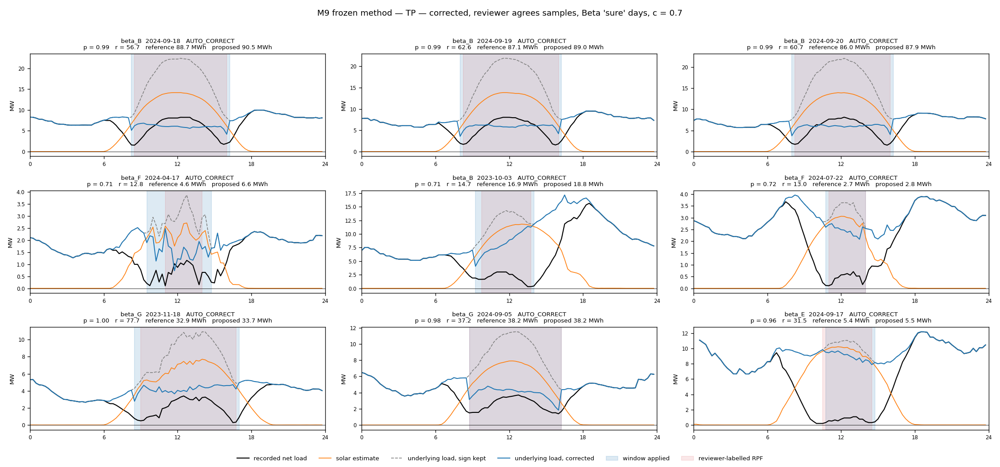
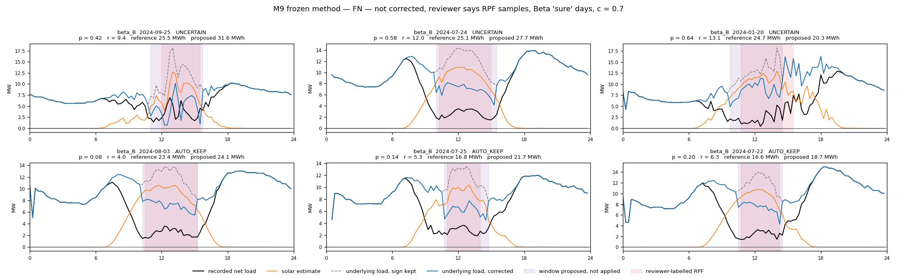
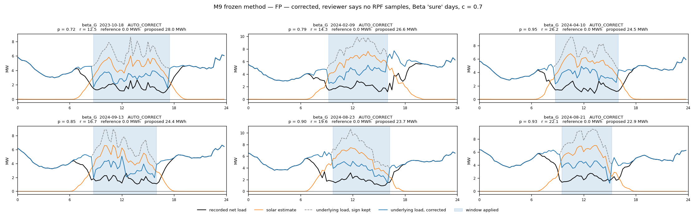
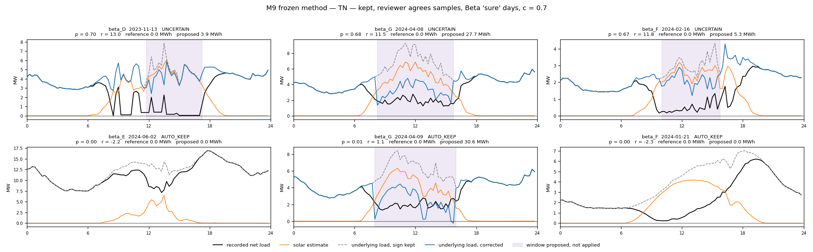

# M9 — as-built method

## 1. What M9 does, in one paragraph

A distribution substation meter records net load $y_t$ (MW, positive = import). When rooftop solar pushes real power back into the network, true net load is negative; some meters record the magnitude but lose the sign, so a negative $y_t$ is stored as $+|y_t|$. M9 takes one site-day of 96 fifteen-minute readings together with a solar estimate $s_t$ and asks, for every possible contiguous daytime window, a single question: *if the readings inside this window had their sign flipped back, would the implied underlying demand look more like ordinary demand than it does now?* The window for which the answer is strongest is proposed; if no window beats "leave it alone", nothing is proposed. The strength of the answer is converted to a probability, and one public confidence setting turns that into `AUTO_CORRECT`, `AUTO_KEEP` or `UNCERTAIN`.

It has one plausibility component and no fitted scoring parameters. What is learned from data is two calibration coefficients that map evidence to probability, nothing else.

## 2. Definitions

| symbol | meaning | unit |
|---|---|---|
| $t = 0,\dots,95$ | fifteen-minute slot index; slot 24 is 06:00, slot 72 is 18:00 | — |
| $y_t$ | recorded net load | MW |
| $s_t$ | reliable solar generation estimate | MW |
| $\mathcal{T} = \{24,\dots,71\}$ | eligible slots, 06:00 inclusive to 18:00 exclusive | — |
| $W = [a,b]$ | a candidate window, $24 \le a \le b \le 71$, length $L = b-a+1$ | — |
| $\varnothing$ | the `NO_CORRECTION` candidate | — |
| $U^{0}_t$ | underlying demand if the recorded sign is kept | MW |
| $U^{W}_t$ | underlying demand if the sign is corrected inside $W$ | MW |
| $c$ | the public confidence control, fixed at 0.7 | — |

The candidate set is $\mathcal{C} = \{\varnothing\} \cup \{[a,b] : 24 \le a \le b \le 71\}$: 1,176 windows plus the null, 1,177 candidates. Every window of every length is scored; nothing is pre-filtered by solar position or duration.

## 3. The two counterfactual reconstructions

Underlying demand is what the customers behind the substation actually consumed: net load plus local generation. Under the hypothesis that the recorded sign is right,

$$U^{0}_t = s_t + y_t \qquad \text{for all } t .$$

Under the hypothesis that the sign is wrong exactly inside $W$,

$$U^{W}_t = \begin{cases} s_t - y_t, & t \in W \\ s_t + y_t, & t \notin W \end{cases}$$

Both use the same $s_t$. On a true sign-error day $U^{0}$ carries a solar-shaped hump of height $2|y_t|$ across the window — the mirror image of the reverse flow — while $U^{W}$ recovers the smooth demand underneath. On a normal day a false window does the opposite: it carves a solar-shaped hole into $U^{W}$. The method's whole job is to tell which of these two pictures is the more ordinary demand curve.

The proposed corrected net load, when a correction is applied, is

$$\tilde{y}_t = \begin{cases} -\,y_t, & t \in W \\ y_t, & t \notin W \end{cases}$$

Raw readings are never overwritten; $\tilde{y}$ is a separate series.

## 4. Admissibility and anchors

A reading is *finite* when both $y_t$ and $s_t$ are present. For a window $W=[a,b]$ define

$$\ell(W) = \max\{k < a : \text{slot } k \text{ finite}\}, \qquad r(W) = \min\{k > b : \text{slot } k \text{ finite}\},$$

the nearest finite readings before and after the window anywhere in the day. **$W$ is admissible iff every slot in $[a,b]$ is finite and both $\ell(W)$ and $r(W)$ exist.** With no missing data, $\ell = a-1$ and $r = b+1$. A missing reading therefore disqualifies only the windows that contain it; the day is `UNCERTAIN` only if no window at all is admissible.

*Why this form.* Two earlier rules were tried and rejected on real data: abstaining the whole day on any missing slot discarded 21 of beta_D's 45 human-obvious days whose missing block lay hours before an intact window; requiring the adjacent slots $a-1$ and $b+1$ to be finite made beta_D's true windows inadmissible because its missing block ends exactly where the reverse flow begins.

## 5. The plausibility criterion: a straight bridge

Ordinary demand over a few hours is close to a straight line. For an admissible window, draw the line through the reconstructed demand at its two anchors:

$$g_W(t) = U^{0}_{\ell} + \frac{t-\ell}{r-\ell}\,\bigl(U^{0}_{r} - U^{0}_{\ell}\bigr), \qquad t \in [a,b].$$

Both reconstructions share this line because they agree outside the window. Measure how far each reconstruction sits from it, summed over the window:

$$\mathrm{RSS}_u(W) = \sum_{t=a}^{b}\bigl(U^{0}_t - g_W(t)\bigr)^2, \qquad \mathrm{RSS}_c(W) = \sum_{t=a}^{b}\bigl(U^{W}_t - g_W(t)\bigr)^2 .$$

Units MW². On a true window $\mathrm{RSS}_u$ is dominated by the hump and $\mathrm{RSS}_c$ is small; on a false window $\mathrm{RSS}_c$ carries the hole and the two edge steps, and $\mathrm{RSS}_u$ is small. The bridge integrates edge continuity and within-window shape into one number, which is why it was the strongest single statistic when the true window was given (AUC 0.997 on both cohorts) and why no second component was needed — every second component tested made the result worse.

## 6. The evidence score: a profile likelihood ratio

Model demand inside the window as the line plus Gaussian noise of *unknown* variance $\sigma^2$. Under either hypothesis the maximised log-likelihood, after estimating $\sigma^2$ from that hypothesis's own residuals, is $-\tfrac{L}{2}\log(\mathrm{RSS}/L)$ plus a constant common to both. Their difference is the evidence for correction:

$$r(W) = \frac{L}{2}\,\log\!\left(\frac{\mathrm{RSS}_u(W) + \lambda_L}{\mathrm{RSS}_c(W) + \lambda_L}\right), \qquad \lambda_L = L\,\phi^2 .$$

$\phi$ is a fixed resolution floor — the smallest non-zero absolute overnight step of $U^{0}$ observed in the cohort's frozen data — which stops a near-perfect fit on a short window producing an unbounded ratio. The null scores $r(\varnothing) = 0$.

Read $r$ as *by what factor does correcting improve the straight-line fit, weighted by how many slots sustain that improvement*. A 20-slot window in which correction makes the line fit five times better scores $10\ln 5 \approx 16$; two times better scores $\approx 7$. The applied thresholds land around 12–15.

*Why this form and not the earlier one.* The 15 September recommendation used $(\mathrm{RSS}_u - \mathrm{RSS}_c)/(\sigma_d^2 L)$ with $\sigma_d$ the median overnight step of demand. That divides by an *external* guess at how rough ordinary demand is, taken at night. On stations whose nights are jagged and days smooth (beta_A, beta_E) it understated the evidence on textbook days by an order of magnitude; on the mirror-image station (beta_B) it overstated it. No place to measure $\sigma_d$ served both. The profile likelihood ratio uses the corrected fit's own residual as the yardstick, so no external scale enters and one threshold transfers across stations. It is the standard statistic for comparing two fits with unknown noise — the same object as an F-test.

The exponent on $L$ was tested: $L^{1}$ (full ratio, adopted), $L^{1/2}$ and $L^{0}$ (per slot). Per slot collapses detection; $L^{1/2}$ trades four points of obvious-day recall for precision and loses Energy IoU.

## 7. Ranking, best window, runner-up

$$W^\star = \arg\max_{W \in \mathcal{C}} r(W)$$

with ties resolved in this order: the null beats any window; the shorter window beats the longer; the earlier start beats the later. If $r(W^\star) \le 0$ the null wins and the best window is retained for inspection as $W^\star$'s runner-up. Otherwise the runner-up is the best admissible window not overlapping $W^\star$ — a genuinely different explanation of the day, not a one-slot shift. Two margins are stored, $r(W^\star)$ against the null and against the runner-up; **neither is confidence.** The runner-up margin has no relationship to localisation quality in the data (Spearman −0.08 in the incumbent's own audit).

## 8. Calibration and decision

Let $R_d = r(W^\star)$ for site-day $d$ (the best window's score even when the null wins, so a day with a weak negative best window is distinguishable from one with none). Apply a variance-stabilising transform and a two-coefficient logistic:

$$z_d = \operatorname{sign}(R_d)\,\log\bigl(1+|R_d|\bigr), \qquad p_d = \frac{1}{1+e^{-(\alpha + \beta z_d)}}, \quad \beta > 0 .$$

$\alpha, \beta$ are fitted by maximum likelihood on training stations of the same cohort — Beta `sure` days, or all Alpha days — against the site-day label. The transform matters: fitted on raw $R_d$, whose 99th percentile on Beta is $10^5$, the logistic saturates and Beta collapses (Energy IoU 0.45, expected calibration error 0.18); on $z_d$ both cohorts calibrate to ECE ≤ 0.02 and one threshold serves both.

With one public control $c \in (0.5, 1)$, fixed at $0.7$:

$$\text{outcome}_d = \begin{cases} \texttt{AUTO\_CORRECT}, & p_d \ge c \\ \texttt{AUTO\_KEEP}, & p_d \le 1-c \\ \texttt{UNCERTAIN}, & \text{otherwise, or no admissible window} \end{cases}$$

Only `AUTO_CORRECT` applies $\tilde y$; the other two return the raw series. At $p_d = 0.5$ the outcome is `UNCERTAIN`, so a tie never forces a correction. Because $\alpha,\beta$ are fixed after fitting, $c$ maps to a raw-score threshold $R^{*}(c)$ that is reported per fold, and $c$ can be moved without retraining anything:

$$R^{*}(c) = \operatorname{sign}(z^{*})\,\bigl(e^{|z^{*}|}-1\bigr), \qquad z^{*} = \frac{\operatorname{logit}(c) - \alpha}{\beta}.$$

$p_d$ has one narrow meaning: *the probability that this site-day requires a correction, under the reviewer's labels and the training population.* It makes no claim that $a$ and $b$ are exactly right.

## 9. Outputs per site-day

Best candidate and score; runner-up and score; both margins; $z_d$, $p_d$, the applied $c$ and its raw thresholds; outcome; proposed window and interval flags; both reconstructions $U^0$ and $U^{W^\star}$; proposed corrected net load $\tilde y$; proposed correction energy; and a reason code (`window_wins`, `null_wins`, `uncertain_band`, `no_admissible_window`). Proposed correction energy for a window is $\sum_{t\in W} 2\,y_t \cdot 0.25$ MWh, because the flip changes each reading by $2y_t$ over a quarter hour.

## 10. Complexity accounting

| | count | what |
|---|---|---|
| Plausibility components | 1 | straight-bridge misfit ratio |
| Fitted scoring parameters | 0 | — |
| Fixed physical settings | 3 | scan range 24–71; floor $\phi$ from the cohort's smallest non-zero overnight step; overnight slots 0–23 used only to compute $\phi$ |
| Calibration parameters | 2 per fold | $\alpha, \beta$ |
| Public controls | 1 | $c$ |

Rejected with evidence during development, so a reader does not have to wonder: a second component (solar consistency, both post-hoc and with joint window selection — worse on every metric); curvature and total-variation smoothness (weaker on recall); an absolute-deviation bridge (worse on every pooled metric); every external noise scale tried (fixes one station, breaks its mirror image); the $L^{1/2}$ exponent; a minimum window duration (short windows carry noise-level energy; $c$ already removes them); a zero-crossing veto for false corrections (five parameter-free forms, none separates true from false); trimming edge slots after detection (cascades on re-anchoring).

## 11. Evaluation protocol as run

Leave-one-station-out within each cohort: for each held-out station, $\alpha,\beta$ are fitted on the other stations of that cohort and the held-out station is scored once. Nothing else is fitted. Alpha (10 stations, 10,425 complete site-days, 3,381 RPF) uses controlled truth. Beta (8 stations, 2,305 `sure` site-days, 470 RPF) uses only reviewer-`sure` days for fitting and headline; `unsure` days are scored and reported as sensitivity. Energy metrics follow the evaluation PRD's provisional definitions and are pooled by summing energies across site-days before dividing. Beta `sure` is the human-parity signal; Alpha is a non-regression check.

**This is a development-conditioned, locked station-held-out comparison, not untouched validation.** The scorer, the statistic and the admissibility rules were chosen with all eighteen stations visible over four adopted rounds; only $\alpha,\beta$ are fitted out of station.

## 12. Results

### Headline, $c = 0.7$

| | Alpha | Beta `sure` |
|---|---|---|
| Reference Energy IoU | 0.864 | **0.881** |
| Reference energy precision | 0.881 | **0.926** |
| Sure-day recall (human-obvious cases found) | 0.917 | **0.896** |
| Site-day precision | 0.975 | 0.957 |
| Site-day F1 | 0.945 | 0.925 |
| `AUTO_CORRECT` rate, all days | 0.305 | 0.191 |
| `UNCERTAIN` rate, all days | 0.018 | 0.036 |
| Calibration ECE | 0.023 | 0.007 |

Alpha energy precision sits below the 0.90 gate by label construction: 42% of Alpha RPF days have non-contiguous synthetic labels, and a perfect one-window localiser scores 0.904. Per your decision, the gate is applied to Beta and Alpha is reported with that ceiling stated. Screen and non-screen stations agree (Beta IoU 0.874 vs 0.889). On reviewer-`unsure` days the model is `UNCERTAIN` 15% of the time against 4% on `sure` days.

### Per station

Alpha:

| station | days | RPF | ref MWh | Energy IoU | energy precision | sure recall | day precision | day F1 | correct rate | uncertain rate |
|---|---|---|---|---|---|---|---|---|---|---|
| alpha_A | 1039 | 0 | 0 | — | — | — | — | — | 0.000 | 0.002 |
| alpha_B | 1055 | 27 | 30 | 0.393 | 0.402 | 0.667 | 0.857 | 0.750 | 0.020 | 0.009 |
| alpha_C | 1055 | 627 | 3752 | 0.841 | 0.861 | 0.907 | 0.964 | 0.935 | 0.559 | 0.040 |
| alpha_D | 1035 | 0 | 0 | — | — | — | — | — | 0.000 | 0.003 |
| alpha_E | 1035 | 700 | 6327 | 0.890 | 0.906 | 0.930 | 0.986 | 0.957 | 0.638 | 0.021 |
| alpha_F | 1033 | 842 | 13357 | 0.880 | 0.893 | 0.942 | 0.992 | 0.966 | 0.773 | 0.032 |
| alpha_G | 1037 | 650 | 5829 | 0.863 | 0.884 | 0.940 | 0.961 | 0.950 | 0.613 | 0.022 |
| alpha_H | 1039 | 0 | 0 | — | — | — | — | — | 0.000 | 0.002 |
| alpha_I | 1042 | 148 | 1200 | 0.767 | 0.782 | 0.872 | 0.970 | 0.918 | 0.128 | 0.012 |
| alpha_J | 1055 | 387 | 1542 | 0.799 | 0.825 | 0.850 | 0.962 | 0.903 | 0.324 | 0.030 |

Beta `sure`:

| station | days | RPF | ref MWh | Energy IoU | energy precision | sure recall | day precision | day F1 | correct rate | uncertain rate |
|---|---|---|---|---|---|---|---|---|---|---|
| beta_A | 337 | 26 | 755 | 0.941 | 0.975 | 0.923 | 1.000 | 0.960 | 0.071 | 0.030 |
| beta_B | 231 | 125 | 4769 | 0.870 | 0.932 | 0.848 | 1.000 | 0.918 | 0.459 | 0.048 |
| beta_C | 339 | 0 | 0 | — | — | — | — | — | 0.000 | 0.003 |
| beta_D | 188 | 45 | 475 | 0.911 | 0.973 | 0.756 | 1.000 | 0.861 | 0.181 | 0.106 |
| beta_E | 306 | 21 | 87 | 0.916 | 0.929 | 1.000 | 1.000 | 1.000 | 0.069 | 0.033 |
| beta_F | 286 | 164 | 1578 | 0.923 | 0.941 | 0.951 | 0.951 | 0.951 | 0.573 | 0.070 |
| beta_G | 283 | 85 | 2202 | 0.859 | 0.879 | 0.929 | 0.878 | 0.903 | 0.318 | 0.035 |
| beta_H | 335 | 4 | 30 | 0.171 | 0.775 | 0.250 | 1.000 | 0.400 | 0.003 | 0.006 |

The four zero-RPF stations correctly receive essentially no corrections. beta_H has four labelled days and 30 MWh; its numbers are not meaningful. alpha_B (27 days, 30 MWh) is the weakest Alpha station and its events are at the noise floor.

### Against M7 and M8 — headline only, with two caveats

The evaluation PRD requires all three methods on identical folds; that run is scheduled for the next cycle. What exists now is the journal notebook's earlier run of M7 and M8, which is **day-level only** (no energy metrics were stored) and, for Beta, is a *transfer* — M8 trained on Alpha and applied to Beta, against an older label vintage with 557 rather than 470 `sure` positives. The Alpha figures are leave-one-station-out and comparable in protocol. Read the Beta column as indicative only.

| site-day level | Alpha precision / recall / F1 | Beta precision / recall / F1 |
|---|---|---|
| M7 (deterministic threshold rule) | 0.530 / 0.989 / 0.690 | 0.192 / 0.761 / 0.307 (transfer, old labels) |
| M8 (two-stage XGBoost) | 0.974 / 0.819 / 0.890 | 0.606 / 0.420 / 0.496 (transfer, old labels) |
| **M9 (this method)** | **0.975 / 0.917 / 0.945** | **0.957 / 0.896 / 0.925** (station-held-out, current labels) |

On Alpha, where the protocols match, M9 holds M8's precision and adds ten points of recall. On Beta the gap is large but the comparison is not like-for-like until the identical-fold run exists.

## 13. Twenty-seven site-day samples

Beta `sure` days, so every panel is a real error or a real non-error a reviewer was confident about. Each panel shows recorded net load (black), the solar estimate (orange), underlying demand with the sign kept (grey dashed), underlying demand if corrected (blue), the window M9 proposed (blue shading if applied, purple if proposed but not applied), and the reviewer's labelled window (red shading). Titles give the outcome, $p$, $r$, reference and proposed MWh. The full index is `figures/samples_index.csv`.

**True positives — 9.** Three largest corrections, three closest to the threshold, three at random.

**False negatives — 6.** Three `UNCERTAIN` and three `AUTO_KEEP`, largest reference energy first. These are the cloudy beta_B days (jagged solar estimate) and beta_D's clipped flanks.

**False positives — 6.** The largest applied corrections. Net load dips to 1–2 MW but never approaches zero while demand rises with solar; a reflected trace must pass through zero.

**True negatives — 6.** Three closest to the threshold, three at random.

## 14. Known limitations

1. **Jagged solar estimates.** On cloudy days the estimate's error enters both reconstructions equally; the ratio is modest even when the hump is large. beta_B loses nine of 125 obvious days this way, seven of them to `UNCERTAIN`. The reviewer's cue — the raw net-load trace mirroring the solar trace — does not need the estimate to be smooth; the counterfactual does.
2. **Meters that clip at zero.** beta_D's flanks read ≈0 for an hour or more after the labelled window while solar is 5–7 MW. A one-window sign flip cannot explain a clipped flank; corrected demand steps from ≈4.5 inside to ≈7 outside. Documented as a second error mode outside M9's scope, by your decision.
3. **Demand that rises with solar.** Sunny days at beta_F and beta_G on which cooling load produces a midday hump and net load never reaches zero. Nineteen false corrections, 267 MWh, all confident. No parameter-free veto separates them from true corrections.
4. **Edge extension.** The profile likelihood ratio weakly rewards any extra slot, so windows run about one slot long at each edge; this is 38% of the remaining Beta Energy IoU loss. The principled fix — scoring every window on one fixed span — is a different method version.
5. **Alpha's label contiguity** caps its energy precision near 0.90 for any one-window method.

## 15. Provenance

Implementation: `PyNRPF/publication/2_journal_article/m9_dev/m9_scorer.py` (reference and vectorised versions checked equal in `tests/`), `m9_metrics.py`, `m9_eval.py`. Frozen record with hashes: `m9_dev/decisions/frozen_method.md` and `runs/phase5_final/config.json`. Development trail: `notes/round_1.md` to `round_6.md`; diagnosis figures under `weak_sites/`. Twenty-two synthetic fixtures; `pytest` and `ruff` clean. Not committed.
